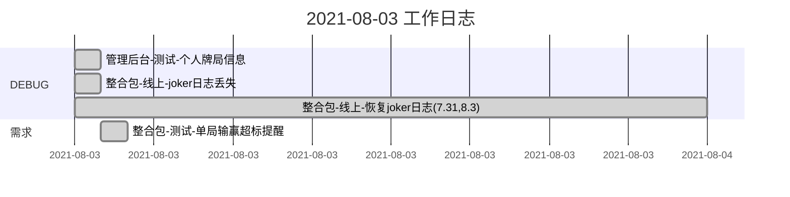
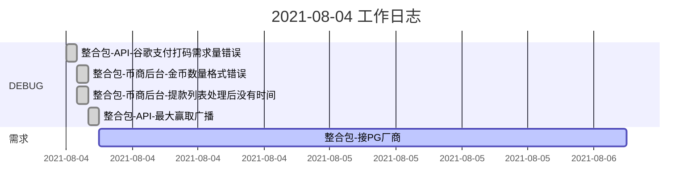
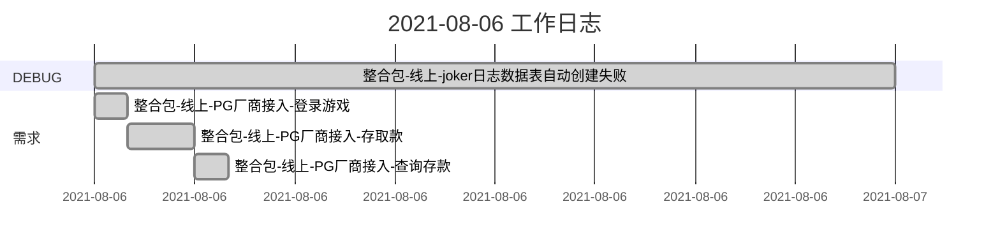
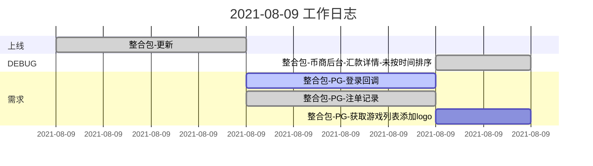

### Bug说明

管理后台-测试-个人牌局信息丢失的原因查明为：因自动脚本没有生成第二天数据表，导致查询数据时因第二天表不存在报错

### Bug备注:

谷歌支付打码量错误: 因支付订单的顺序问题(先更改状态-再发货 改后为 发货-更改状态)导致新用户历史首单被重复计算

整合包-线上-joker日志恢复[^1]

$\color{red}更新问题:$

1、日志权限问题

2、数据库结构没有同步的问题

3、配置问题

4、BUG

[^1]:8-3日计划恢复线上joker日志

