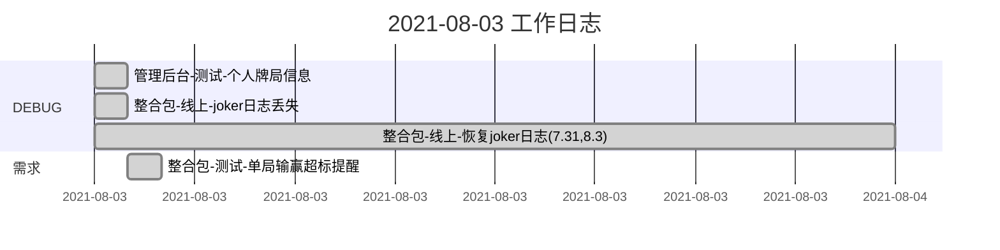
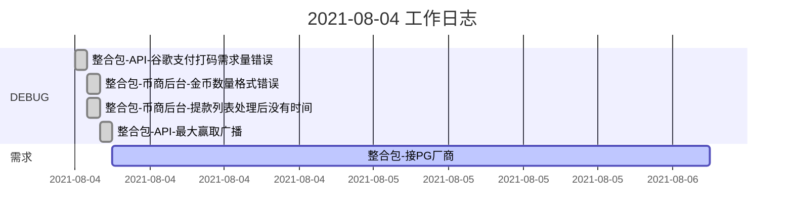

```mermaid
gantt
	title	2021-08-03 工作日志
	dateFormat YYYY-MM-DD
	section DEBUG
	管理后台-测试-个人牌局信息: done, bug1, 2021-08-03, 1h
	整合包-线上-joker日志丢失: done, bug2, 2021-08-03, 1h
	整合包-线上-恢复joker日志(7.31,8.3): done, 2021-08-03, 2021-08-04
	section 需求
	整合包-测试-单局输赢超标提醒: done, feture1, after bug2, 1h
```

### Bug说明

管理后台-测试-个人牌局信息丢失的原因查明为：因自动脚本没有生成第二天数据表，导致查询数据时因第二天表不存在报错

```mermaid
gantt
	title 2021-08-04 工作日志
	dateFormat YYYY-MM-DD
	section DEBUG
	整合包-API-谷歌支付打码需求量错误: done, bug1, 2021-08-04, 1h
	整合包-币商后台-金币数量格式错误: done, bug2, after bug1, 1h
	整合包-币商后台-提款列表处理后没有时间: done, bug3, after bug1, 1h
	整合包-API-最大赢取广播: done, bug4, after bug3,1h
	section 需求
	整合包-接PG厂商: active, fetrue1, after bug4, 2d
```

### Bug备注:

谷歌支付打码量错误: 因支付订单的顺序问题(先更改状态-再发货 改后为 发货-更改状态)导致新用户历史首单被重复计算

整合包-线上-joker日志恢复[^1]

[^1]:8-3日计划恢复线上joker日志

